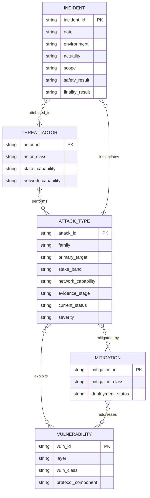
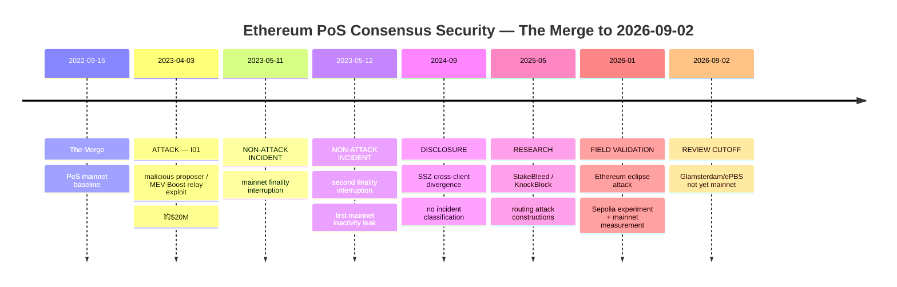

# Ethereum PoS コンセンサス攻撃の体系的レビュー：The Merge 後から現在まで

## エグゼクティブ・サマリー

本レビューの対象は、**The Merge により Ethereum mainnet が Proof-of-Stake（PoS）へ移行した 2022年9月15日から、2026年9月2日まで**である。Ethereum の PoS コンセンサスは、概念上は **LMD-GHOST による fork choice と Casper FFG による finality** を組み合わせた構造として捉えるのが最も有用であり、Ethereum 公式の脅威モデルは攻撃者の主要な達成目標を **reorganization（reorg）、double finality、finality delay** の三つに整理している。reorg は二重支払い、MEV、検閲などに利用でき、finalized block の巻き戻しは少なくとも大規模な slashable stake を犠牲にする「economic finality」を伴う。 citeturn16view0

文献を横断すると、Ethereum PoS に対する攻撃は大きく五系列に整理できる。第一は、**ブロックや attestation の保留、公開タイミング、equivocation を使って honest validator の fork-choice view をずらす低ステーク攻撃**であり、ex-ante reorg、balancing、LMD-balancing、bouncing、epoch-boundary finality-delay などが含まれる。第二は、**ステーク閾値そのものを利用する攻撃**であり、公式資料ではおおむね 33% で finality delay、34% で double finality、51% で censorship と将来チェーンの支配、66% で過去を含むチェーン支配まで能力が増えると整理されている。 citeturn16view1turn16view4

第三は、近年重要性が増している **ネットワーク層との合成攻撃**である。2025–2026年の研究は BGP/routing を使って inactivity leak を誘発する **StakeBleed** と、特定 proposer を孤立させる **KnockBlock** を示し、さらに 2026年の研究は Ethereum の post-Merge execution-layer P2P に対する end-to-end eclipse attack を Sepolia 上で実証し、mainnet を広範に測定した。これらは Gasper の数理そのものを破るというより、**Gasper が暗黙に依存するメッセージ到達性・参加率・ネットワーク観測可能性を攻撃する**点が重要である。 citeturn17view2turn15view8

第四は、**client implementation divergence** である。2024年に公開された “Ghost in the Block” は Prysm と Lighthouse の SSZ deserialization の差が、悪用された場合に Ethereum consensus を深刻に劣化させ得たことを示している。つまり multi-client architecture は単一実装障害への耐性を高める一方、仕様解釈の非同一性そのものが consensus-split attack surface になり得る。 citeturn15view9

第五は **MEV-Boost / proposer-builder separation（PBS）という PoS block-production 周辺層**である。これは Gasper の core consensus ではないが、実際の PoS proposer のブロック生成経路に深く組み込まれてきたため、本レビューでは「consensus-adjacent」として明示的に別カテゴリ化した。2023年4月には malicious proposer が mev-boost-relay の検証欠陥を悪用し、無効な header に署名して builder payload を取得した後、自分のブロックで sandwich bots から約2,000万ドルを奪う**確認済み mainnet 攻撃**が発生している。Flashbots は同日中に relay patch を展開した。 citeturn15view4

最も重要な実証的結論は、**本レビューで調査した公開一次資料・研究・セキュリティ報告の範囲では、2022年9月15日から2026年9月2日までに、悪意ある攻撃者が mainnet の Gasper core を利用して double finality、finalized-history reversal、あるいは敵対的な network-wide finality halt を実現した確認済み事例は見つからなかった**ことである。一方、2023年5月11–12日には mainnet が実際に finality を一時喪失し、二度目では inactivity leak が発動したが、これは client/resource-processing 上の技術障害として記録されており、公開情報上は攻撃ではない。 citeturn20search4turn20search28

なお、2026年9月2日時点でも Glamsterdam は **devnet testing 中で mainnet 導入予定は Q4 2026**、Sepolia fork も 2026年9月28日予定である。したがって EIP-7732 の enshrined PBS（ePBS）はまだ mainnet の前提ではなく、第三者 relay に依存する MEV-Boost のリスクは、本レビューの cutoff 時点では依然として「現行の consensus-adjacent threat surface」と扱うべきである。 citeturn19view0

## 範囲・方法・仮定

本調査は厳密な PRISMA 登録型 systematic review ではなく、**structured systematic mapping review** とした。起点を Ethereum Foundation / ethereum.org の公式 PoS attack taxonomy と Consensus Specifications に置き、そこから引用論文・後続研究を snowballing し、2024–2026年の academic/security literature について routing、eclipse、client divergence、PBS を追加検索した。公式 Ethereum 文書は現行仕様・mitigation status の判断に優先し、論文は攻撃能力・前提条件・新規 attack construction の判断に利用した。 citeturn16view0turn15view3turn17view4

**期間の仮定**は次のとおりである。実インシデントは 2022年9月15日以後のみを採用する。一方、攻撃手法の文献については、Neuder et al. や Schwarz-Schilling et al. のように Merge 前に発表されたものでも、**The Merge 後に mainnet で使用された Beacon-chain PoS / LMD-GHOST / Casper-FFG を直接対象としており、post-Merge の脅威モデルを形成した研究は採用**した。PoW の longest-chain/hashpower attacks、PoW selfish mining、PoW 51% attack は除外する。Neuder et al. は sub-1/3 stakeholder による reorg と finality-delay、Schwarz-Schilling et al. はより低ステークで成立する refined attacks を明示的に PoS Ethereum 向けに構成している。 citeturn17view0turn17view1

**包含範囲**は、fork choice、FFG finality、validator participation/penalty、weak subjectivity、consensus/client interoperability、P2P/routing による consensus availability、および実際の PoS block production を直接仲介する PBS/MEV-Boost とした。一般的な smart-contract exploit、bridge exploit、wallet/key theft、DeFi oracle manipulation、execution-layer transaction DoS は、それ自体では除外した。ただし validator key compromise が equivocation や double vote を実行する場合は、結果として表中の consensus attack にマッピング可能である。

**実インシデントの包含基準**は厳しく設定した。「mainnet または実運用インフラで、意図的な adversarial action が実行され、公開一次資料または複数の信頼できる資料で確認可能」である。controlled testnet experiment、mainnet measurement のみ、responsible disclosure のみ、偶発的 software outage は「攻撃インシデント」から除外し、Notes とタイムラインで境界事象として示す。

**重大度の仮定**は CVSS ではなく Ethereum-consensus 向けの四段階評価とした。「致命」は finalized safety/double-finality/history integrity を破り得るもの、「高」は sustained reorg、network-wide finality loss、強い censorship を生じ得るもの、「中」は proposer 単体・局所的 liveness、MEV/block-production integrity に主に影響するもの、「低」は現行仕様では直接成立しないものを指す。別に **残余優先度 P0–P3** を設け、P0 は即時最優先、P1 は継続的な高優先監視、P2 は中優先、P3 は既知 mitigation が強い／historical な攻撃とする。この優先度は「攻撃成功確率」の定量推定ではなく、impact、必要資源、現在の mitigation、実証水準を合わせたレビュー上の比較指標である。

2026年9月2日時点の現行性については、Glamsterdam/ePBS をまだ mainnet 導入済みとは扱わない。Ethereum 公式 roadmap は Glamsterdam を devnet testing、mainnet Q4 2026 予定としているためである。 citeturn19view0

## 優先ソース

**最優先は Ethereum 公式仕様・脅威モデルである。** 特に ethereum.org の *Ethereum proof-of-stake attack and defense* は、reorg / double finality / finality delay、small-stake attacks、balancing/bouncing、long-range、stake thresholds を一つの taxonomy に統合しており、本レビューの基準文書とした。 citeturn16view0turn16view1turn16view2turn16view3turn16view4 Consensus Specifications の Weak Subjectivity Guide は long-range attack の評価で優先した。 citeturn15view3 現行／将来境界については Ethereum 公式 Glamsterdam roadmap と EIP-7732/ePBS の status を優先した。 citeturn19view0

**次点は査読・学術研究である。** 基礎文献として Neuder et al., *Low-cost attacks on Ethereum 2.0 by sub-1/3 stakeholders*、Schwarz-Schilling et al., *Three Attacks on Proof-of-Stake Ethereum*、Neu et al., *Two Attacks on Proof-of-Stake GHOST/Ethereum* を優先した。 citeturn17view0turn17view1turn17view6 LMD-GHOST の構造的 reorg-resilience 問題については D'Amato et al., *Goldfish: No More Attacks on Ethereum?!* を参照した。 citeturn17view4

post-Merge の新しい研究として、Pavloff et al. の inactivity-leak/penalty analysis、USENIX Security 2025 掲載の Zhang et al. *Available Attestation*、Financial Cryptography 2026 向けの Doumanidis & Apostolaki *Routing Attacks in Ethereum PoS*、WWW 2026 の Shi et al. *Eclipse Attacks on Ethereum’s Peer-to-Peer Network* を高優先とした。 citeturn17view3turn17view5turn17view2turn15view8

**セキュリティ報告・実装者 postmortem は実現可能性と incident verification に優先**した。client divergence では Asymmetric Research の “Ghost in the Block”、PBS 実悪用では Flashbots の 2023年4月3日 postmortem、非攻撃 finality incident の対照例では Prysm/Offchain Labs の mainnet postmortem を採用した。 citeturn15view9turn15view4turn20search4

主要 crypto news outlets は一次資料の代替ではなく、日付・public impact・patch deployment の補助確認にのみ使用した。たとえば The Block は 2023年5月の finality interruption と Prysm/Teku patch を報じているが、技術的根拠は client-side postmortem を優先した。 citeturn20search28turn20search4

CERT/CVE/CERT-CC 系 advisories も検索対象に置いたが、本レビューの厳格な包含基準を満たし、かつ Ethereum PoS consensus attack の一次証拠として使用すべきものは最終 evidence set に残らなかった。このため、CERT を無理に二次資料の代替として引用していない。

## 攻撃手法の体系化

| ID | 攻撃族 | 一次対象 | 主要手段 | 必要ステーク | NW能力 | Slash行為 | 主影響 | 代表結果 | 証拠段階 | 現行状態 | 主要緩和 | 潜在重大度 | 残余優先度 | 根拠 |
|---|---|---|---|---|---|---|---|---|---|---|---|---|---|---|
| A01 | 再編 | LMD-GHOST | 保留+時機 | 極小 | 精密時機 | 不要 | 安全性+公正性 | 短期再編 | 公式+理論 | 部分緩和 | PB | 高 | P1 | S1+S3+S4 |
| A02 | 再編 | LMD-GHOST+PB | 保留+時機 | <1/3 | 精密時機 | 不要 | 安全性+公正性 | 短期再編 | 公式+理論 | 現行理論 | 研究中 | 高 | P1 | S1+S7 |
| A03 | 再編 | LMD-GHOST | 同時二重+選択配送 | 極小 | 選択配送 | 使用 | 活性+安全性 | 最終化遅延 | 公式+理論 | 緩和済 | PB | 高 | P3 | S1 |
| A04 | 再編 | LMD-GHOST | 同時二重+選択配送 | 極小 | 選択配送 | 使用 | 活性+安全性 | 最終化遅延 | 公式+理論 | 緩和済 | ED | 高 | P3 | S1+S5 |
| A05 | 最終化 | Casper-FFG | 保留+時機 | <1/3 | 精密時機 | 不要 | 活性 | 最終化遅延 | 公式+理論 | 部分緩和 | JCW+PB | 高 | P2 | S1+S6 |
| A06 | 最終化 | Casper-FFG | 保留+時機 | <1/3 | 精密時機 | 不要 | 活性 | 最終化遅延 | 公式+理論 | 現行理論 | IL+研究中 | 高 | P2 | S1+S3 |
| A07 | 再編 | GHOST | 大量同時二重 | 極小 | 不要 | 使用 | 安全性+活性 | 再編 | 公式+理論 | 実装非該当 | LMD+ED | 高 | P3 | S1+S5 |
| A08 | 最終化 | WS+FFG | 旧鍵+代替履歴 | 非限定 | 不要 | 非該当 | 安全性 | 長期再編 | 公式 | 設計上防御 | FFG+WS | 致命 | P2 | S1+S2 |
| A09 | 多数派 | Casper-FFG | 棄権 | ≥1/3 | 不要 | 不要 | 活性 | 最終化停止 | 公式 | 現行 | IL | 高 | P2 | S1 |
| A10 | 多数派 | Casper-FFG | 二重投票 | ≥34% | 分割+時機 | 必須 | 安全性 | 二重最終化 | 公式 | 現行 | SL+L0 | 致命 | P1 | S1 |
| A11 | 多数派 | LMD-GHOST | 多数派投票 | ≥51% | 不要 | 不要 | 安全性+検閲耐性 | 検閲+将来支配 | 公式 | 現行 | L0 | 致命 | P1 | S1 |
| A12 | 多数派 | Gasper | 多数派投票+二重投票 | ≥66% | 不要 | 必須 | 安全性 | 履歴支配 | 公式 | 現行 | SL+L0 | 致命 | P1 | S1 |
| A13 | ネットワーク | 提案者 | DoS | 0 | DoS | 不要 | 活性+検閲耐性 | ミススロット | 公式 | 現行 | NET+研究中 | 中 | P2 | S1 |
| A14 | 最終化 | Casper-FFG+IL | 分割+罰則増幅 | <1/3 | 分割 | 不要 | 安全性+活性 | 安全閾値侵食 | 理論 | 現行理論 | 研究中 | 致命 | P1 | S6 |
| A15 | ネットワーク | IL+BGP | BGP分離 | 0 | BGP | 不要 | 活性+公正性 | 最終化停止+罰則 | 論文実証 | 周辺現行 | NET | 高 | P1 | S8 |
| A16 | ネットワーク | 提案者+BGP | BGP分離 | 0 | BGP | 不要 | 可用性+公正性 | ミススロット+MEV | 論文実証 | 周辺現行 | NET | 中 | P2 | S8 |
| A17 | ネットワーク | EL-P2P | Eclipse | 0 | Eclipse | 不要 | 可用性 | ノード隔離 | 実地実証 | 周辺現行 | NET | 高 | P2 | S9 |
| A18 | 実装差 | SSZ+CL | 不一致入力 | 非限定 | 一般P2P | 非該当 | 安全性+活性 | 合意劣化 | セキュリティ実証 | 部分緩和 | PATCH | 高 | P2 | S10 |
| A19 | PBS | MEV-Boost | 遅延要求 | 極小 | Relay制御 | 不要 | 活性+市場完全性 | ミススロット | 公式実証 | 周辺緩和済 | PATCH | 中 | P3 | S11 |
| A20 | PBS | MEV-Boost | 不正Header | 極小 | Relay制御 | 不要 | 市場完全性 | 資金窃取 | 野生悪用 | 周辺緩和済 | PATCH | 高 | P2 | S11+S13 |
| A21 | PBS | MEV-Boost | Relay不達 | 0 | Relay制御 | 非該当 | 活性 | ミススロット | 公式脅威 | 周辺現行 | FB | 中 | P2 | S12+S13 |

### Notes（攻撃手法）

**列設計の理由。** `攻撃族` は攻撃を reorg/finality/stake-majority/network/client/PBS という比較可能な上位 taxonomy に落とすために置いた。`一次対象` は脆弱性が LMD-GHOST、Casper-FFG、weak subjectivity、network、SSZ、MEV-Boost のどこに位置するかを分離する。`主要手段` は attacker action を withholding、timing、equivocation、partition、DoS、implementation discrepancy などに正規化する。`必要ステーク` と `NW能力` を分離したのは、現代の Ethereum threat model では stake と network control が代替・合成されることが多いためである。特に routing research は、Ethereum stake を持たない routing adversary が consensus participation を変化させ得ることを示す。 citeturn17view2

`Slash行為` は「攻撃が成功するために slashable equivocation が必要か」を表し、単なる inactivity penalty とは分けている。`主影響` と `代表結果` は security property と observable outcome を分離する。`証拠段階` により formal/theoretical result と real-world exploit を混同しない。`現行状態` は current-mainnet applicability を、`主要緩和` は dominant defense を、`潜在重大度` は成功時の impact を、`残余優先度` は mitigation と実現性まで加味した現在の研究・防御優先順位を示す。

**カテゴリコード。** `極小` は single-validator/vanishingly-small stake を含む。`<1/3` は 33% 未満、`≥34%` は double-finality threshold 周辺、`≥51%` と `≥66%` は Ethereum 公式の能力閾値に合わせた。Ethereum 公式は 33%→finality delay、34%→double finality、51%→censorship/future control、66%→past control まで能力が増えると説明している。 citeturn16view4

mitigation code は、`PB=proposer boost`、`ED=equivocation discounting`、`JCW=justified-checkpoint switching window`、`LMD=Latest Message Driven rule`、`FFG=Casper FFG finality`、`WS=weak-subjectivity checkpoint`、`SL=slashing`、`IL=inactivity leak`、`L0=social/L0 recovery`、`NET=network/routing hardening`、`PATCH=implementation patch`、`FB=local block-production fallback` である。Ethereum 公式は bouncing への対策として justified checkpoint の switching を epoch の最初の 1/3 に制限し、balancing/bouncing の成立を大幅に困難にしたと説明している。 citeturn16view2

**S1 = Ethereum 公式 PoS attack-and-defense。** A01–A13 の基準 taxonomy と stake thresholds はこの資料を最上位ソースとした。同資料は low-stake attacks を主として under-activity/over-activity、information withholding、opportune release に帰着させ、known balancing/bouncing/avalanche vectors は client/protocol patches と実ネットワーク条件によって難しくなったと評価している。 citeturn16view1turn16view4

**A01 — ex-ante / short-range reorg。** Neuder et al. は block と attestation を withholding して適切な時点で公開することで honest block を canonical chain から除く攻撃を提示し、元の解析では 30% attacker を評価した。その後の研究は必要 stake/network assumptions を大幅に下げた。Ethereum 公式も 30% から 2%、さらに balancing を組み合わせた single-validator construction まで研究が進んだ経緯をまとめている。 citeturn17view0turn17view1turn16view1

**A02 — proposer-boost を逆用する reorg。** proposer boost は cheap balancing/reorg を防ぐために導入された一方、Ethereum 公式は理想化された latency 条件では約7% stake の attacker が votes を戦略的に配置して honest block を reorg する construction が示されたと説明する。2025年の *Available Attestation* は、既知 Ethereum PoS attacks の多くを reorganization attack と統一的に捉え、五種類の reorg attack に耐える fork-choice modification を提案している。 citeturn16view2turn17view5

**A03–A04 — balancing attacks。** balancing の核は competing forks をほぼ同重量にして honest validators の view を分裂させることである。LMD-specific variant は first-arriving/latest-message semantics を equivocation と選択的 message timing で利用し、proposer boost を回避する construction として示された。Neu et al. は LMD を直接狙う balancing variant を提示したが、Ethereum の現行脅威モデルは known balancing vectors が patches で閉じられ、精密な selective delivery が現実には難しいと評価している。 citeturn17view6turn16view2turn16view4

**A05 — bouncing。** bouncing は competing justified checkpoints の間で fork-choice view を「跳ねさせ」、2/3 supermajority が一つの target に集まるのを妨害する liveness attack である。checkpoint switching を epoch の最初の 1/3 に制限する protocol change が主要 mitigation となった。しかし後続研究は probabilistic bouncing と inactivity leak の相互作用を再検討しているため、「完全消滅」ではなく「部分緩和」と評価した。 citeturn16view2turn17view3

**A06 — epoch-boundary finality-delay。** Neuder et al. の second attack は epoch-boundary proposer が block を遅延公開し、honest FFG votes を異なる checkpoint targets に割ることで 2/3 supermajority を形成させない。stake が小さいほど proposer selection と release timing の精度が要求される。 citeturn17view0turn16view3

**A07 — avalanche。** generic PoS-GHOST では attacker が多数の equivocating blocks を作ることで orphaned branches に fork-choice weight を与える construction が示された。しかし Neu et al. 自身が LMD により straightforward version が阻止されると述べており、Ethereum 公式も現行 client が equivocations を重複計上しないことを主要防御としている。このため current-LMD-GHOST に対しては「実装非該当」とした。 citeturn17view6turn16view3

**A08 — long-range / weak-subjectivity attack。** 単純な long-range fork は finalized blocks を reorg しない Ethereum client と trusted recent weak-subjectivity checkpoint によって通常の synced node には受け入れられない。Consensus Specs は weak-subjectivity period と checkpoint distribution/sync procedure を仕様化している。したがってこれは現在の「容易に実行可能な mainnet reorg」ではなく、特に長期間 offline だった node や bootstrap trust が誤った場合に意味を持つ operational residual risk とした。 citeturn16view3turn15view3

**A09–A12 — stake-threshold attacks。** 1/3 程度の stake は finality を止められ、約34% の contradictory votes は double finality、51% は fork-choice majority と censorship、66% は attacker's chain 自体を supermajority-finalize できる領域に入る。ただし contradictory finalization は slashable evidence を残し、大規模 attack は stake destruction と社会的 recovery の対象になり得るため、「潜在 impact が高い」ことと「economically cheap である」ことは同義ではない。 citeturn16view0turn16view4

**A13 — proposer-targeted DoS。** PoS では近い将来の proposer identity が予測可能であることが targeted DoS の attack surface になり得る。ここでの成功は通常 double finality ではなく missed slot、temporary censorship、block-production loss であるため重大度を「中」とした。Ethereum 公式 threat discussion は proposer DoS を、consensus safety より availability の問題として扱っている。 citeturn15view1

**A14 — inactivity-leak amplification。** Pavloff et al. は Byzantine validators と inactivity leak が組み合わさると、honest/offline stake の penalty によって Byzantine voting-power fraction が相対的に上昇し、一部のシナリオで critical one-third safety threshold を越え得ること、probabilistic bouncing と組み合わせて safety violation の条件が生じ得ることを理論解析した。これは 2023年に mainnet で inactivity leak が実際に発動した後に重要性が増した research line である。 citeturn17view3turn20academia40

**A15–A16 — StakeBleed / KnockBlock。** Routing Attacks in Ethereum PoS は protocol penalties と Internet routing weaknesses の合成を初めて体系化した。StakeBleed は BGP hijacking により validator groups を分離して inactivity leak と finality halt を誘発し、論文モデルでは 30 IP prefixes 程度の hijack で2時間に約300 ETH 相当の validator losses を生じ得る。KnockBlock は対象 proposer の block inclusion を妨げ、単一 prefix の短時間 hijack で attacker の expected MEV を増加させ得る。これらは「悪用済み mainnet incident」ではなく practical research results である。 citeturn17view2

**A17 — eclipse。** Shi et al. は post-Merge Ethereum execution-layer node に対して discovery-table poisoning、official DNS crawler poisoning、connection-slot hijacking を組み合わせる end-to-end eclipse attack を構成し、Sepolia で controlled validation、mainnet で広範な measurements を実施した。outgoing redirection success を 45% から95%に高める結果も報告している。これは execution-layer P2P attack だが、validator stack の chain view と availability を破壊し得るため consensus-enabling attack として掲載した。 citeturn15view8

**A18 — client divergence。** “Ghost in the Block” は同一 SSZ bytes に対する Prysm/Lighthouse の deserialization behavior の違いから、attacker-controlled input が異なる client populations に異なる consensus behavior を起こし得る問題を示した。個別 vulnerability は disclosure/patch の対象だが、仕様と複数実装の deterministic equivalence は恒常的な attack surface なので、攻撃「クラス」の残余優先度は P2 とした。 citeturn15view9

**A19–A20 — malicious proposer と MEV-Boost。** 2023年4月 incident 後、Flashbots はさらに「consecutive proposer が slot の遅い時点で relay に payload を要求し、自分の slot を故意に逃しながら payload を取得する」timing vector を特定し、relay response cutoff を導入した。実悪用された A20 では、relay が signed header の validity を十分確認せず payload を proposer に返したため、attacker が invalid header を使って builder block body を入手し、sandwich transactions を自分の block へ再配置した。 citeturn15view4

**A21 — relay withholding/non-delivery。** off-protocol PBS では relay が proposer と builder の間の availability/trust chokepoint になる。local block production fallback は liveness defense になるが、ePBS が mainnet に enshrine されるまでは relay dependence 自体は消えない。Glamsterdam/ePBS は 2026年9月2日時点で devnet testing 中であり、mainnet Q4 2026 予定である。 citeturn19view0

**S2–S13 の対応。** `S2=Consensus Specs Weak Subjectivity`、`S3=Neuder et al.`、`S4=Schwarz-Schilling et al.`、`S5=Neu et al.`、`S6=Pavloff et al.`、`S7=Available Attestation`、`S8=Routing Attacks`、`S9=Eclipse Attacks`、`S10=Ghost in the Block`、`S11=Flashbots 2023 postmortem`、`S12=MEV-Boost liveness/risk documentation`、`S13=Ethereum Glamsterdam/ePBS status` である。 citeturn15view3turn17view0turn17view1turn17view6turn17view3turn17view5turn17view2turn15view8turn15view9turn15view4turn19view0

「nothing-at-stake」は独立行にしていない。Ethereum では実際に問題となる行為を equivocation/double-vote/proposer equivocation としてより具体的に A03/A04/A07/A10/A12 に分解できるためである。同様に generic validator-key theft、RANDAO bias、smart-contract MEV は、fork-choice/finality/PBS attack を直接実行する段階に至らない限り本表から除外した。

## 実インシデント

| ID | 日付 | 環境 | 実在性 | 攻撃性 | 主体 | 対応手法 | 対象層 | 目的 | 合意影響 | Safety | Finality | 金銭影響 | 損失帯 | 修正 | スコープ判定 | 重大度 | 根拠 |
|---|---|---|---|---|---|---|---|---|---|---|---|---|---|---|---|---|---|
| I01 | 2023-04-03 | Mainnet | 野生悪用 | 悪意 | 提案者 | A20 | 周辺PBS | 利益 | 局所 | 維持 | 維持 | 有 | $10–50M | PATCH | Consensus-adjacent | 高 | S11 |

### Notes（実インシデント）

**列設計の理由。** `実在性` は theoretical construction と in-the-wild exploit を分離するため、`攻撃性` は偶発障害と intentional adversarial behavior を分離するために置いた。`対応手法` は technique table との join key であり、両表を relational dataset として扱える。`対象層` と `スコープ判定` は特に重要で、Gasper-core exploit と consensus-adjacent PBS exploit を混同させないための列である。`Safety` と `Finality` を独立させたのは、一時的な liveness disturbance と finalized safety violation が全く異なる重大性を持つためである。

`損失帯` は `0 / <$1M / $1–10M / $10–50M / >$50M / 不明` の ordinal category とした。`合意影響` は `無 / 局所 / ネットワーク`、`Safety` と `Finality` は `維持 / 侵害 / 不明`、`スコープ判定` は `Core / Consensus-adjacent` の有限カテゴリである。

**I01 の事実関係。** Flashbots の一次 postmortem によれば、malicious proposer は ultra sound relay が使用していた open-source mev-boost-relay implementation の vulnerability を悪用し、複数の sandwich bots から約2,000万ドルを奪った。relay は proposer が署名した header が invalid でも block body を返していたため、attacker は payload を読んだ後、自身の valid block に取引を再配置できた。beacon nodes は attacker が relay に返した invalid header 自体は拒否しており、攻撃によって Gasper の double finality や finalized-chain safety が破られたわけではない。 citeturn15view4

Flashbots の詳細 timeline では最初の悪意ある request は 2023年4月2日 23:29 UTC に行われ、public identification と incident response が4月3日に進んでいるため、本表では postmortem の慣例に従って `2023-04-03` を incident date とした。同日には relay shutdown、testnet testing、patch release、mainnet deployment が行われた。 citeturn15view4

**Core Gasper attack incident のレビュー結果はゼロ件である。** より厳密には、「2022年9月15日–2026年9月2日の公開 evidence set から、悪意ある第三者が Ethereum mainnet の LMD-GHOST/Casper-FFG を直接攻撃して double finality、finalized-history reversal、または intentional network-wide finality loss に成功した事例を確認できなかった」という negative finding である。これは「秘密裏の攻撃が絶対に存在しなかった」という証明ではない。Ethereum 公式自身も small-stake timing attacks や stake-threshold attacks を脅威モデルとして維持している一方、known bouncing/balancing/avalanche vectors の多くは patch され、実ネットワークで要求される精密 message control は難しいと評価している。 citeturn16view4

**2023年5月11–12日の finality loss は重要な対照事象だが、攻撃表からは除外した。** Ethereum mainnet は二度、一時的に finality を失い、最初は約4 epochs、二度目は約9 epochs にわたって finalization が遅延し、二度目では inactivity penalty/leak が作動した。Prysm の mainnet postmortem は chain が外部介入なしで recovery したと記録しており、The Block も Prysm/Teku client patches によって対処された technical issue と報告している。従って「実 consensus failure」ではあるが、「real-world attack」には分類しない。 citeturn20search4turn20search28

この区別は A14 の評価にも重要である。2023年5月の inactivity leak そのものは攻撃ではなかったが、その実動作を受け、後続研究は malicious Byzantine behavior と inactivity leak を組み合わせると safety margin が悪化するシナリオを示した。**incident と attack technique は同じものではない**。 citeturn17view3

同様に、2024年の SSZ client-divergence vulnerability は「could have allowed an attacker to severely degrade Ethereum consensus」と報告された security finding であり、本レビューで確認した資料では successful malicious mainnet exploitation として扱う根拠がない。そのため technique table A18 には含めるが incident table には入れない。 citeturn15view9

StakeBleed / KnockBlock も authors が practical/effective と評価しているものの、論文上の routing attack construction と測定・評価であって、公開資料上の in-the-wild malicious incident ではない。 citeturn17view2 2026年 eclipse attack も Sepolia での controlled experiment と mainnet measurements であり、研究者による field validation なので実攻撃件数には含めない。 citeturn15view8

したがって、incident data を件数だけで読むと「攻撃がほぼない」ように見えるが、これは attack surface が小さいことの直接証明ではない。むしろ研究 literature は、**attack surface が「大量 stake を買う」だけでなく、timing、routing、client heterogeneity、PBS middleware、penalty dynamics へ移っている**ことを示している。 citeturn17view1turn17view2turn17view3turn15view9

## 推奨 Mermaid 図

**Entity-relationship chart。** データモデルとしては `AttackType` を中心に、`ThreatActor`、`Vulnerability`、`Mitigation`、`Incident` を多対多で結ぶのが適切である。特に incident と technique を分離すると、「A14 は実証的研究だが incident がない」「A20 は I01 という実悪用がある」という差を機械的に表現できる。

この ER model では、たとえば `validator/proposer` が A01/A02/A06/A19/A20、`stake-majority actor` が A09–A12、`routing adversary` が A15/A16、`remote P2P adversary` が A17/A18、`relay` が A21 に結びつく。mitigation 側では proposer boost、equivocation discounting、weak subjectivity、slashing、inactivity leak、network hardening、implementation patch、L0 recovery などを独立 entity として持たせると、複数攻撃への mitigation reuse を表現できる。これらの関係は Ethereum 公式 threat model、Consensus Specs、および routing/client/PBS 文献から導出した分類である。 citeturn16view2turn15view3turn17view2turn15view9turn15view4

**Incident / evidence timeline。** 実攻撃だけでは I01 の一点になってしまうため、実務上は attack incident と「誤って attack と数えやすい境界事象」を一緒に描き、ラベルで区別する形が最も情報量が高い。

この timeline の attack / non-attack 区分は意図的である。2023年4月の MEV-Boost event は malicious exploitation として Flashbots が確認している。2023年5月の finality interruptions は client-side technical incident として記録されている。routing attacks は 2025年に初稿、2026年4月に改訂された研究成果で、eclipse work は 2026年の controlled field study である。さらに 2026年9月2日時点で Glamsterdam は devnet testing 中、mainnet は Q4 2026 予定である。 citeturn15view4turn20search4turn17view2turn15view8turn19view0